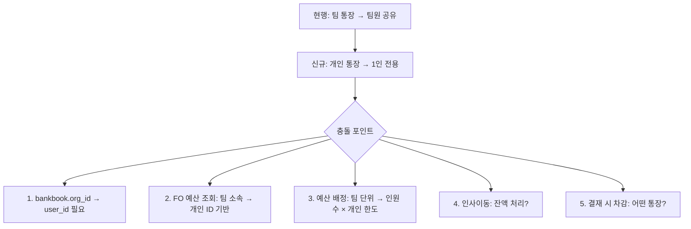
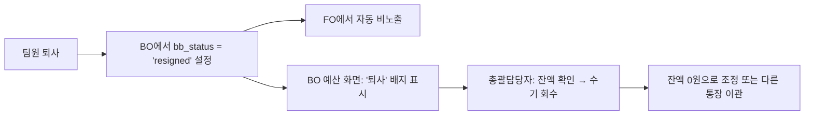
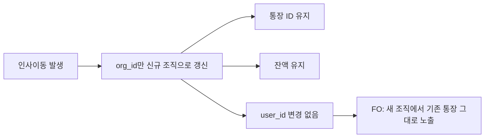

# PRD: 개인별 분리 통장 기능

> **문서 버전**: v1.1 | **작성일**: 2026-04-10 | **상태**: 정책 확정

---

## 1. 배경 및 목적

### 1.1 현행 시스템

현재 예산 계정의 **통장 생성 정책**은 2가지:

| 정책 | `bankbook_mode` | 설명 | 예시 |
|---|---|---|---|
| **팀별 분리 통장** | `isolated` | 하위 팀마다 개별 통장 생성 | 내구기술팀 통장, 전동화설계팀 통장 |
| **상위 조직 공유 통장** | `shared` | 본부단위 통장 1개를 하위 팀이 공유 | 연구개발본부 단일 통장 |

### 1.2 신규 요구사항

> **"통장을 개인마다 관리해야 한다"**

연간 자기계발비, 어학교육비, 자격증 취득지원금 등 **개인에게 고정 한도가 배정되는 교육예산**에 대해,
팀 통장이 아닌 **개인별 통장**으로 분리 관리가 필요.

> [!NOTE]
> 회사 정책상 개인에게 **성장지원금**으로 할당하는 예산이므로, 개인에 귀속되는 성격입니다.

---

## 2. 비판적 분석 — 왜 단순하지 않은가

> [!WARNING]
> 이 기능은 기존 **"조직 중심"** 예산 아키텍처를 **"개인 중심"**으로 확장하는 것이므로,
> 모든 예산 관련 모듈에 파급 영향이 있습니다.

### 2.1 핵심 충돌 지점



### 2.2 확정된 정책 결정

| # | 질문 | 확정 결정 | 근거 |
|---|---|---|---|
| 1 | 개인 한도 초과 시 팀 잔액 사용? | ❌ **불가** — 개인 한도 내에서만 엄격 사용 | 성장지원금의 개인 할당 취지 |
| 2 | 인사이동 시 통장 처리? | **통장 유지 + 잔액 유지** (org_id만 갱신) | 성장지원금은 개인 귀속 예산 |
| 3 | 팀장 개인 통장 조회 범위? | **상세 내역까지** 조회 가능 | 관리자 감독 의무 |
| 4 | 팀원 퇴사 시? | 총괄담당자가 **수기 회수**, 통장에 `퇴사` 표시 | 자동 회수 대신 운영 유연성 확보 |
| 5 | 신규 입사자 통장? | **자동 생성** — VOrg 소속 팀 입사 시 개인 통장 자동 생성 | 운영 누락 방지 |
| 6 | 한 사람이 여러 계정에 개인 통장? | ⭕ 가능 — 계정별 정책 독립 | 참가=개인, 운영=팀 가능 |

---

## 3. 설계 제안

### 3.1 DB 스키마 변경

#### `budget_account_org_policy` — bankbook_mode 확장

```diff
bankbook_mode: 'isolated' | 'shared' 
+                | 'individual'   -- 개인별 분리 통장 추가
```

#### `org_budget_bankbooks` — user_id, status 컬럼 추가

```sql
ALTER TABLE org_budget_bankbooks
  ADD COLUMN user_id TEXT DEFAULT NULL,     -- 개인 통장 소유자 user ID
  ADD COLUMN user_name TEXT DEFAULT NULL,   -- 표시용 이름 캐시
  ADD COLUMN bb_status TEXT DEFAULT 'active'; -- 'active' | 'resigned' (퇴사자 표시)
```

| 기존 팀 통장 | 개인 통장 (재직) | 개인 통장 (퇴사) |
|---|---|---|
| `user_id = NULL` | `user_id = 'P401'`, `bb_status = 'active'` | `user_id = 'P401'`, `bb_status = 'resigned'` |

> [!IMPORTANT]
> `org_id`는 **제거하지 않음**. 개인 통장도 소속 조직을 추적해야 합니다 (보고서/관리자 집계용).

#### `budget_account_org_policy` — 개인 한도 필드 추가

```sql
ALTER TABLE budget_account_org_policy
  ADD COLUMN individual_limit NUMERIC DEFAULT NULL; -- 개인별 기본 한도 (원)
```

### 3.2 통장 생성 정책 UI 변경 (BO)

기존 2가지 옵션에 **세 번째 옵션** 추가:

```
┌────────────────────────┐  ┌────────────────────────┐  ┌────────────────────────┐
│ ● 팀별 분리 통장       │  │ ○ 상위 조직 공유 통장  │  │ ○ 개인별 분리 통장     │
│   하위 팀마다 개별      │  │   본부 단위 통장 1개   │  │   팀원 1인당 개별 통장  │
│   예) 내구기술팀 통장   │  │   예) 연구개발본부     │  │   예) 홍길동 참가통장   │
└────────────────────────┘  └────────────────────────┘  │ 💰 1인당 한도: _____원  │
                                                        └────────────────────────┘
```

**개인별 선택 시 추가 입력:**
- 기본 한도 (원) — 예: 1인당 500,000원
- 자동 생성 트리거 — VOrg 맵핑 시 해당 팀 학습자 전원에게 자동 생성

### 3.3 FO 학습자 경험

#### 현행 (팀 통장)
```
예산 현황: [역량혁신팀 운영] 잔액 5,000,000원  ← 팀 공유
```

#### 변경 후 (개인 통장)
```
예산 현황: [내 참가비] 잔액 500,000원  ← 나만의 한도
           ⚠️ 한도 초과 불가 — 잔액 범위 내에서만 신청 가능
```

#### 로딩 로직 변경 (`fo_persona_loader.js`)

```diff
// 1. 내 팀 직접 통장 조회
  const { data: directBbs } = await sb
    .from('org_budget_bankbooks')
    .select(...)
-   .eq('org_id', persona.orgId)
+   .or(`and(org_id.eq.${persona.orgId},user_id.is.null),user_id.eq.${persona.id}`)
    .eq('tenant_id', persona.tenantId)
+   .eq('bb_status', 'active');  // 퇴사자 통장 제외
```

**개인 통장 필터 규칙:**
- `user_id IS NULL` → 기존 팀 통장 (org_id로 매칭)
- `user_id = 내 ID` → 개인 통장 (본인만 조회)
- `user_id IS NOT NULL AND user_id ≠ 내 ID` → 타인 통장 (❌ 제외)
- `bb_status = 'resigned'` → 퇴사자 통장 (FO ❌ 제외, BO에서만 표시)

### 3.4 퇴사자 통장 처리



**BO 퇴사자 통장 UI:**
```
┌─────────────────────────────────────────┐
│ 😶 홍길동 참가통장      [퇴사] ⚠️        │
│    잔액: 250,000원                       │
│    [잔액 회수]  [이관]  [통장 폐쇄]       │
└─────────────────────────────────────────┘
```

### 3.5 신규 입사자 자동 통장 생성

> [!TIP]
> 운영 누락 방지를 위해, 신규 입사자가 **개인 통장 정책이 적용된 계정의 VOrg 소속 팀**에 배치되면 자동으로 개인 통장을 생성합니다.

**자동 생성 트리거 3가지:**

| 트리거 | 시점 | 동작 |
|---|---|---|
| ① VOrg 팀 맵핑 시 | BO에서 팀을 VOrg 그룹에 맵핑할 때 | 해당 팀의 전체 학습자에게 개인 통장 일괄 생성 |
| ② FO 첫 로그인 시 | 학습자가 FO에 처음 접속할 때 | 개인 통장이 없으면 자동 생성 + 기본 한도 배정 |
| ③ BO 수동 동기화 | 관리자가 "통장 동기화" 버튼 클릭 | 해당 VOrg 전체 팀의 누락된 개인 통장 일괄 보정 |

**② FO 자동 생성 로직 (`fo_persona_loader.js`):**

```javascript
// 개인 통장 정책인데 내 통장이 없는 경우 → 자동 생성
if (policy.bankbook_mode === 'individual' 
    && !directBbs.find(bb => bb.account_id === acctId && bb.user_id === persona.id)) {
  const newBb = {
    tenant_id: persona.tenantId,
    org_id: persona.orgId,
    org_name: persona.dept,
    account_id: acctId,
    template_id: tplId,
    user_id: persona.id,
    user_name: persona.name,
    bb_status: 'active',
  };
  await sb.from('org_budget_bankbooks').insert(newBb);
  // 기본 한도 배정
  await sb.from('budget_allocations').insert({
    bankbook_id: newBb.id,
    allocated_amount: policy.individual_limit || 0,
    used_amount: 0, frozen_amount: 0,
  });
}
```

### 3.6 인사이동 시 통장 처리



> [!NOTE]
> **성장지원금은 개인 귀속**이므로, 조직 변경 시 잔액을 회수하지 않습니다.
> 조직 변경 시 통장의 `org_id`, `org_name`만 새 소속 조직으로 갱신합니다.

---

## 4. 서비스 영향도 분석

### 4.1 영향 받는 모듈

| 영향도 | 모듈 | 변경 내용 |
|---|---|---|
| 🔴 **높음** | `fo_persona_loader.js` | 통장 조회 쿼리: `org_id OR user_id` + 자동 생성 |
| 🔴 **높음** | `bo_budget_master.js` | 통장 정책 UI에 `individual` 옵션 + 한도 입력 |
| 🔴 **높음** | `_syncBankbooksForTemplate()` | 개인 통장 대량 생성 로직 추가 |
| 🟡 **중간** | `plans.js` / `apply.js` | 예산 차감 시 개인 통장 엄격 한도 검증 |
| 🟡 **중간** | `budget.js` (FO) | 개인 통장 카드 표시 + 잔액 |
| 🟡 **중간** | `approval.js` | 결재 시 개인 한도 초과 차단 |
| 🟡 **중간** | BO 예산 배정 화면 | 퇴사자 통장 표시/회수 UI |
| 🟢 **낮음** | `cross_tenant.js` | 크로스 테넌트 시 개인 통장도 user_id 기반 조회 |

### 4.2 리스크 및 대응

| 리스크 | 심각도 | 대응 방안 |
|---|---|---|
| 통장 수 폭증 (100명 × 5계정 = 500통장) | 🟡 중 | DB 인덱스 + 배치 생성 |
| 인사이동 시 통장 org_id 갱신 누락 | 🟡 중 | BO "통장 동기화" 수동 트리거로 보정 |
| 신규 입사자 통장 누락 | 🟢 낮 | FO 첫 로그인 시 자동 생성 (트리거 ②) |
| 퇴사자 잔액 방치 | 🟡 중 | BO에서 `resigned` 뱃지 + 총괄 알림 |
| 기존 데이터 마이그레이션 | 🟢 낮 | `user_id = NULL`은 기존 팀 통장 → 호환성 유지 |

### 4.3 적용 가능한 실제 시나리오

| 계정 | 통장 정책 | 근거 |
|---|---|---|
| HMC-OPS (일반-운영) | `isolated` (팀별) | 팀 단위 교육 운영비 관리 |
| HMC-PART (일반-참가) | `individual` (개인별) | **개인 자기계발비 연간 한도** |
| HMC-ETC (일반-기타) | `isolated` (팀별) | 기타 비용은 팀 공유 |
| 어학교육비 | `individual` (개인별) | 1인당 연간 어학지원금 |
| 자격증지원금 | `individual` (개인별) | 1인당 자격증 취득 지원 한도 |

---

## 5. 구현 우선순위

### Phase 1: 인프라 (필수)
1. DB 스키마: `org_budget_bankbooks`에 `user_id`, `user_name`, `bb_status` 추가
2. DB 스키마: `budget_account_org_policy`에 `individual_limit` 추가
3. `bankbook_mode`에 `individual` 값 지원

### Phase 2: BO 관리
4. 통장 정책 UI에 `개인별 분리 통장` 옵션 + 한도 입력 추가
5. `_syncBankbooksForTemplate` 확장: 학습자 목록 → 개인 통장 일괄 생성
6. 퇴사자 통장 관리 UI (`resigned` 표시, 잔액 회수 버튼)

### Phase 3: FO 학습자
7. `fo_persona_loader.js`: 통장 조회 확장 + 신규 입사자 자동 생성
8. 예산 카드 UI: "내 참가비 통장" 표시 + 한도 초과 차단
9. 교육 신청 시 개인 통장 엄격 한도 검증

### Phase 4: 팀장 조회
10. 팀 뷰에서 팀원 개인 통장 상세 내역 조회
11. BO 예산 배정 화면: 개인 통장 일괄 한도 설정/조정

---

## 6. 정책 결정 이력

| 일자 | 결정 | 근거 |
|---|---|---|
| 2026-04-10 | 개인 한도 초과 시 팀 통장 사용 **불가** | 성장지원금 개인 할당 취지 엄격 준수 |
| 2026-04-10 | 인사이동 시 통장 **유지** + 잔액 **유지** | 성장지원금은 개인 귀속 예산 |
| 2026-04-10 | 팀장은 팀원 개인 통장 **상세 내역까지 조회** 가능 | 관리자 감독 의무 |
| 2026-04-10 | 퇴사자 통장은 **총괄담당자가 수기 회수** | `bb_status='resigned'`로 표시만, 자동 회수 안 함 |
| 2026-04-10 | 신규 입사자는 **FO 첫 로그인 시 자동 생성** | 운영 누락 방지 |

