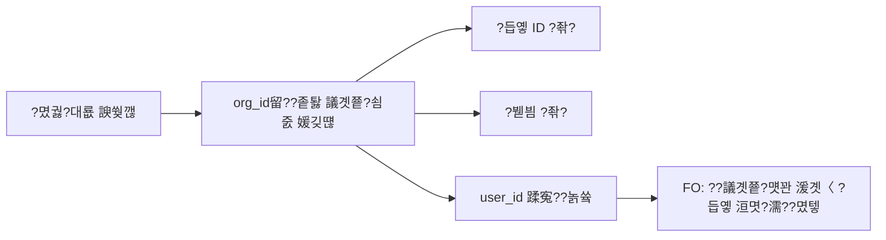

# PRD: 媛쒖씤蹂?遺꾨━ ?듭옣 湲곕뒫

> **臾몄꽌 踰꾩쟾**: v1.1 | **?묒꽦??*: 2026-04-10 | **?곹깭**: ?뺤콉 ?뺤젙

---

## 1. 諛곌꼍 諛?紐⑹쟻

### 1.1 ?꾪뻾 ?쒖뒪??
?꾩옱 ?덉궛 怨꾩젙??**?듭옣 ?앹꽦 ?뺤콉**?€ 2媛€吏€:

| ?뺤콉 | `bankbook_mode` | ?ㅻ챸 | ?덉떆 |
|---|---|---|---|
| **?€蹂?遺꾨━ ?듭옣** | `isolated` | ?섏쐞 ?€留덈떎 媛쒕퀎 ?듭옣 ?앹꽦 | ?닿뎄湲곗닠?€ ?듭옣, ?꾨룞?붿꽕怨꾪? ?듭옣 |
| **?곸쐞 議곗쭅 怨듭쑀 ?듭옣** | `shared` | 蹂몃??⑥쐞 ?듭옣 1媛쒕? ?섏쐞 ?€??怨듭쑀 | ?곌뎄媛쒕컻蹂몃? ?⑥씪 ?듭옣 |

### 1.2 ?좉퇋 ?붽뎄?ы빆

> **"?듭옣??媛쒖씤留덈떎 愿€由ы빐???쒕떎"**

?곌컙 ?먭린怨꾨컻鍮? ?댄븰援먯쑁鍮? ?먭꺽利?痍⑤뱷吏€?먭툑 ??**媛쒖씤?먭쾶 怨좎젙 ?쒕룄媛€ 諛곗젙?섎뒗 援먯쑁?덉궛**???€??
?€ ?듭옣???꾨땶 **媛쒖씤蹂??듭옣**?쇰줈 遺꾨━ 愿€由ш? ?꾩슂.

> [!NOTE]
> ?뚯궗 ?뺤콉??媛쒖씤?먭쾶 **?깆옣吏€?먭툑**?쇰줈 ?좊떦?섎뒗 ?덉궛?대?濡? 媛쒖씤??洹€?띾릺???깃꺽?낅땲??

---

## 2. 鍮꾪뙋??遺꾩꽍 ?????⑥닚?섏? ?딆?媛€

> [!WARNING]
> ??湲곕뒫?€ 湲곗〈 **"議곗쭅 以묒떖"** ?덉궛 ?꾪궎?띿쿂瑜?**"媛쒖씤 以묒떖"**?쇰줈 ?뺤옣?섎뒗 寃껋씠誘€濡?
> 紐⑤뱺 ?덉궛 愿€??紐⑤뱢???뚭툒 ?곹뼢???덉뒿?덈떎.

### 2.1 ?듭떖 異⑸룎 吏€??
```mermaid
graph TD
    A[?꾪뻾: ?€ ?듭옣 ???€??怨듭쑀] --> B[?좉퇋: 媛쒖씤 ?듭옣 ??1???꾩슜]
    B --> C{異⑸룎 ?ъ씤??
    C --> D[1. bankbook.org_id ??user_id ?꾩슂]
    C --> E[2. FO ?덉궛 議고쉶: ?€ ?뚯냽 ??媛쒖씤 ID 湲곕컲]
    C --> F[3. ?덉궛 諛곗젙: ?€ ?⑥쐞 ???몄썝 ??횞 媛쒖씤 ?쒕룄]
    C --> G[4. ?몄궗?대룞: ?붿븸 泥섎━?]
    C --> H[5. 寃곗옱 ??李④컧: ?대뼡 ?듭옣?]
```

### 2.2 ?뺤젙???뺤콉 寃곗젙

| # | 吏덈Ц | ?뺤젙 寃곗젙 | 洹쇨굅 |
|---|---|---|---|
| 1 | 媛쒖씤 ?쒕룄 珥덇낵 ???€ ?붿븸 ?ъ슜? | ??**遺덇?** ??媛쒖씤 ?쒕룄 ?댁뿉?쒕쭔 ?꾧꺽 ?ъ슜 | ?깆옣吏€?먭툑??媛쒖씤 ?좊떦 痍⑥? |
| 2 | ?몄궗?대룞 ???듭옣 泥섎━? | **?듭옣 ?좎? + ?붿븸 ?좎?** (org_id留?媛깆떊) | ?깆옣吏€?먭툑?€ 媛쒖씤 洹€???덉궛 |
| 3 | ?€??媛쒖씤 ?듭옣 議고쉶 踰붿쐞? | **?곸꽭 ?댁뿭源뚯?** 議고쉶 媛€??| 愿€由ъ옄 媛먮룆 ?섎Т |
| 4 | ?€???댁궗 ?? | 珥앷큵?대떦?먭? **?섍린 ?뚯닔**, ?듭옣??`?댁궗` ?쒖떆 | ?먮룞 ?뚯닔 ?€???댁쁺 ?좎뿰???뺣낫 |
| 5 | ?좉퇋 ?낆궗???듭옣? | **?먮룞 ?앹꽦** ??VOrg ?뚯냽 ?€ ?낆궗 ??媛쒖씤 ?듭옣 ?먮룞 ?앹꽦 | ?댁쁺 ?꾨씫 諛⑹? |
| 6 | ???щ엺???щ윭 怨꾩젙??媛쒖씤 ?듭옣? | 狩?媛€????怨꾩젙蹂??뺤콉 ?낅┰ | 李멸?=媛쒖씤, ?댁쁺=?€ 媛€??|

---

## 3. ?ㅺ퀎 ?쒖븞

### 3.1 DB ?ㅽ궎留?蹂€寃?
#### `budget_account_org_policy` ??bankbook_mode ?뺤옣

```diff
bankbook_mode: 'isolated' | 'shared' 
+                | 'individual'   -- 媛쒖씤蹂?遺꾨━ ?듭옣 異붽?
```

#### `org_budget_bankbooks` ??user_id, status 而щ읆 異붽?

```sql
ALTER TABLE org_budget_bankbooks
  ADD COLUMN user_id TEXT DEFAULT NULL,     -- 媛쒖씤 ?듭옣 ?뚯쑀??user ID
  ADD COLUMN user_name TEXT DEFAULT NULL,   -- ?쒖떆???대쫫 罹먯떆
  ADD COLUMN bb_status TEXT DEFAULT 'active'; -- 'active' | 'resigned' (?댁궗???쒖떆)
```

| 湲곗〈 ?€ ?듭옣 | 媛쒖씤 ?듭옣 (?ъ쭅) | 媛쒖씤 ?듭옣 (?댁궗) |
|---|---|---|
| `user_id = NULL` | `user_id = 'P401'`, `bb_status = 'active'` | `user_id = 'P401'`, `bb_status = 'resigned'` |

> [!IMPORTANT]
> `org_id`??**?쒓굅?섏? ?딆쓬**. 媛쒖씤 ?듭옣???뚯냽 議곗쭅??異붿쟻?댁빞 ?⑸땲??(蹂닿퀬??愿€由ъ옄 吏묎퀎??.

#### `budget_account_org_policy` ??媛쒖씤 ?쒕룄 ?꾨뱶 異붽?

```sql
ALTER TABLE budget_account_org_policy
  ADD COLUMN individual_limit NUMERIC DEFAULT NULL; -- 媛쒖씤蹂?湲곕낯 ?쒕룄 (??
```

### 3.2 ?듭옣 ?앹꽦 ?뺤콉 UI 蹂€寃?(BO)

湲곗〈 2媛€吏€ ?듭뀡??**??踰덉㎏ ?듭뀡** 異붽?:

```
?뚢??€?€?€?€?€?€?€?€?€?€?€?€?€?€?€?€?€?€?€?€?€?€?€?? ?뚢??€?€?€?€?€?€?€?€?€?€?€?€?€?€?€?€?€?€?€?€?€?€?€?? ?뚢??€?€?€?€?€?€?€?€?€?€?€?€?€?€?€?€?€?€?€?€?€?€?€???????€蹂?遺꾨━ ?듭옣       ?? ?????곸쐞 議곗쭅 怨듭쑀 ?듭옣  ?? ????媛쒖씤蹂?遺꾨━ ?듭옣     ????  ?섏쐞 ?€留덈떎 媛쒕퀎      ?? ??  蹂몃? ?⑥쐞 ?듭옣 1媛?  ?? ??  ?€??1?몃떦 媛쒕퀎 ?듭옣  ????  ?? ?닿뎄湲곗닠?€ ?듭옣   ?? ??  ?? ?곌뎄媛쒕컻蹂몃?     ?? ??  ?? ?띻만??李멸??듭옣   ???붴??€?€?€?€?€?€?€?€?€?€?€?€?€?€?€?€?€?€?€?€?€?€?€?? ?붴??€?€?€?€?€?€?€?€?€?€?€?€?€?€?€?€?€?€?€?€?€?€?€?? ???뮥 1?몃떦 ?쒕룄: _____?? ??                                                        ?붴??€?€?€?€?€?€?€?€?€?€?€?€?€?€?€?€?€?€?€?€?€?€?€??```

**媛쒖씤蹂??좏깮 ??異붽? ?낅젰:**
- 湲곕낯 ?쒕룄 (?? ???? 1?몃떦 500,000??- ?먮룞 ?앹꽦 ?몃━嫄???VOrg 留듯븨 ???대떦 ?€ ?숈뒿???꾩썝?먭쾶 ?먮룞 ?앹꽦

### 3.3 FO ?숈뒿??寃쏀뿕

#### ?꾪뻾 (?€ ?듭옣)
```
?덉궛 ?꾪솴: [??웾?곸떊?€ ?댁쁺] ?붿븸 5,000,000?? ???€ 怨듭쑀
```

#### 蹂€寃???(媛쒖씤 ?듭옣)
```
?덉궛 ?꾪솴: [??李멸?鍮? ?붿븸 500,000?? ???섎쭔???쒕룄
           ?좑툘 ?쒕룄 珥덇낵 遺덇? ???붿븸 踰붿쐞 ?댁뿉?쒕쭔 ?좎껌 媛€??```

#### 濡쒕뵫 濡쒖쭅 蹂€寃?(`fo_persona_loader.js`)

```diff
// 1. ???€ 吏곸젒 ?듭옣 議고쉶
  const { data: directBbs } = await sb
    .from('org_budget_bankbooks')
    .select(...)
-   .eq('org_id', persona.orgId)
+   .or(`and(org_id.eq.${persona.orgId},user_id.is.null),user_id.eq.${persona.id}`)
    .eq('tenant_id', persona.tenantId)
+   .eq('bb_status', 'active');  // ?댁궗???듭옣 ?쒖쇅
```

**媛쒖씤 ?듭옣 ?꾪꽣 洹쒖튃:**
- `user_id IS NULL` ??湲곗〈 ?€ ?듭옣 (org_id濡?留ㅼ묶)
- `user_id = ??ID` ??媛쒖씤 ?듭옣 (蹂몄씤留?議고쉶)
- `user_id IS NOT NULL AND user_id ????ID` ???€???듭옣 (???쒖쇅)
- `bb_status = 'resigned'` ???댁궗???듭옣 (FO ???쒖쇅, BO?먯꽌留??쒖떆)

### 3.4 ?댁궗???듭옣 泥섎━

```mermaid
graph LR
    A[?€???댁궗] --> B[BO?먯꽌 bb_status = 'resigned' ?ㅼ젙]
    B --> C[FO?먯꽌 ?먮룞 鍮꾨끂異?
    B --> D[BO ?덉궛 ?붾㈃: '?댁궗' 諛곗? ?쒖떆]
    D --> E[珥앷큵?대떦?? ?붿븸 ?뺤씤 ???섍린 ?뚯닔]
    E --> F[?붿븸 0?먯쑝濡?議곗젙 ?먮뒗 ?ㅻⅨ ?듭옣 ?닿?]
```

**BO ?댁궗???듭옣 UI:**
```
?뚢??€?€?€?€?€?€?€?€?€?€?€?€?€?€?€?€?€?€?€?€?€?€?€?€?€?€?€?€?€?€?€?€?€?€?€?€?€?€?€?€?????샄 ?띻만??李멸??듭옣      [?댁궗] ?좑툘        ????   ?붿븸: 250,000??                      ????   [?붿븸 ?뚯닔]  [?닿?]  [?듭옣 ?먯뇙]       ???붴??€?€?€?€?€?€?€?€?€?€?€?€?€?€?€?€?€?€?€?€?€?€?€?€?€?€?€?€?€?€?€?€?€?€?€?€?€?€?€?€??```

### 3.5 ?좉퇋 ?낆궗???먮룞 ?듭옣 ?앹꽦

> [!TIP]
> ?댁쁺 ?꾨씫 諛⑹?瑜??꾪빐, ?좉퇋 ?낆궗?먭? **媛쒖씤 ?듭옣 ?뺤콉???곸슜??怨꾩젙??VOrg ?뚯냽 ?€**??諛곗튂?섎㈃ ?먮룞?쇰줈 媛쒖씤 ?듭옣???앹꽦?⑸땲??

**?먮룞 ?앹꽦 ?몃━嫄?3媛€吏€:**

| ?몃━嫄?| ?쒖젏 | ?숈옉 |
|---|---|---|
| ??VOrg ?€ 留듯븨 ??| BO?먯꽌 ?€??VOrg 洹몃９??留듯븨????| ?대떦 ?€???꾩껜 ?숈뒿?먯뿉寃?媛쒖씤 ?듭옣 ?쇨큵 ?앹꽦 |
| ??FO 泥?濡쒓렇????| ?숈뒿?먭? FO??泥섏쓬 ?묒냽????| 媛쒖씤 ?듭옣???놁쑝硫??먮룞 ?앹꽦 + 湲곕낯 ?쒕룄 諛곗젙 |
| ??BO ?섎룞 ?숆린??| 愿€由ъ옄媛€ "?듭옣 ?숆린?? 踰꾪듉 ?대┃ | ?대떦 VOrg ?꾩껜 ?€???꾨씫??媛쒖씤 ?듭옣 ?쇨큵 蹂댁젙 |

**??FO ?먮룞 ?앹꽦 濡쒖쭅 (`fo_persona_loader.js`):**

```javascript
// 媛쒖씤 ?듭옣 ?뺤콉?몃뜲 ???듭옣???녿뒗 寃쎌슦 ???먮룞 ?앹꽦
if (policy.bankbook_mode === 'individual' 
    && !directBbs.find(bb => bb.account_id === acctId && bb.user_id === persona.id)) {
  const newBb = {
    tenant_id: persona.tenantId,
    org_id: persona.orgId,
    org_name: persona.dept,
    account_id: acctId,
    template_id: tplId,
    user_id: persona.id,
    user_name: persona.name,
    bb_status: 'active',
  };
  await sb.from('org_budget_bankbooks').insert(newBb);
  // 湲곕낯 ?쒕룄 諛곗젙
  await sb.from('budget_allocations').insert({
    bankbook_id: newBb.id,
    allocated_amount: policy.individual_limit || 0,
    used_amount: 0, frozen_amount: 0,
  });
}
```

### 3.6 ?몄궗?대룞 ???듭옣 泥섎━



> [!NOTE]
> **?깆옣吏€?먭툑?€ 媛쒖씤 洹€??*?대?濡? 議곗쭅 蹂€寃????붿븸???뚯닔?섏? ?딆뒿?덈떎.
> 議곗쭅 蹂€寃????듭옣??`org_id`, `org_name`留????뚯냽 議곗쭅?쇰줈 媛깆떊?⑸땲??

---

## 4. ?쒕퉬???곹뼢??遺꾩꽍

### 4.1 ?곹뼢 諛쏅뒗 紐⑤뱢

| ?곹뼢??| 紐⑤뱢 | 蹂€寃??댁슜 |
|---|---|---|
| ?뵶 **?믪쓬** | `fo_persona_loader.js` | ?듭옣 議고쉶 荑쇰━: `org_id OR user_id` + ?먮룞 ?앹꽦 |
| ?뵶 **?믪쓬** | `bo_budget_master.js` | ?듭옣 ?뺤콉 UI??`individual` ?듭뀡 + ?쒕룄 ?낅젰 |
| ?뵶 **?믪쓬** | `_syncBankbooksForTemplate()` | 媛쒖씤 ?듭옣 ?€???앹꽦 濡쒖쭅 異붽? |
| ?윞 **以묎컙** | `plans.js` / `apply.js` | ?덉궛 李④컧 ??媛쒖씤 ?듭옣 ?꾧꺽 ?쒕룄 寃€利?|
| ?윞 **以묎컙** | `budget.js` (FO) | 媛쒖씤 ?듭옣 移대뱶 ?쒖떆 + ?붿븸 |
| ?윞 **以묎컙** | `approval.js` | 寃곗옱 ??媛쒖씤 ?쒕룄 珥덇낵 李⑤떒 |
| ?윞 **以묎컙** | BO ?덉궛 諛곗젙 ?붾㈃ | ?댁궗???듭옣 ?쒖떆/?뚯닔 UI |
| ?윟 **??쓬** | `cross_tenant.js` | ?щ줈???뚮꼳????媛쒖씤 ?듭옣??user_id 湲곕컲 議고쉶 |

### 4.2 由ъ뒪??諛??€??
| 由ъ뒪??| ?ш컖??| ?€??諛⑹븞 |
|---|---|---|
| ?듭옣 ????쬆 (100紐?횞 5怨꾩젙 = 500?듭옣) | ?윞 以?| DB ?몃뜳??+ 諛곗튂 ?앹꽦 |
| ?몄궗?대룞 ???듭옣 org_id 媛깆떊 ?꾨씫 | ?윞 以?| BO "?듭옣 ?숆린?? ?섎룞 ?몃━嫄곕줈 蹂댁젙 |
| ?좉퇋 ?낆궗???듭옣 ?꾨씫 | ?윟 ??| FO 泥?濡쒓렇?????먮룞 ?앹꽦 (?몃━嫄??? |
| ?댁궗???붿븸 諛⑹튂 | ?윞 以?| BO?먯꽌 `resigned` 諭껋? + 珥앷큵 ?뚮┝ |
| 湲곗〈 ?곗씠??留덉씠洹몃젅?댁뀡 | ?윟 ??| `user_id = NULL`?€ 湲곗〈 ?€ ?듭옣 ???명솚???좎? |

### 4.3 ?곸슜 媛€?ν븳 ?ㅼ젣 ?쒕굹由ъ삤

| 怨꾩젙 | ?듭옣 ?뺤콉 | 洹쇨굅 |
|---|---|---|
| HMC-OPS (?쇰컲-?댁쁺) | `isolated` (?€蹂? | ?€ ?⑥쐞 援먯쑁 ?댁쁺鍮?愿€由?|
| HMC-PART (?쇰컲-李멸?) | `individual` (媛쒖씤蹂? | **媛쒖씤 ?먭린怨꾨컻鍮??곌컙 ?쒕룄** |
| HMC-ETC (?쇰컲-湲고?) | `isolated` (?€蹂? | 湲고? 鍮꾩슜?€ ?€ 怨듭쑀 |
| ?댄븰援먯쑁鍮?| `individual` (媛쒖씤蹂? | 1?몃떦 ?곌컙 ?댄븰吏€?먭툑 |
| ?먭꺽利앹??먭툑 | `individual` (媛쒖씤蹂? | 1?몃떦 ?먭꺽利?痍⑤뱷 吏€???쒕룄 |

---

## 5. 援ы쁽 ?곗꽑?쒖쐞

### Phase 1: ?명봽??(?꾩닔)
1. DB ?ㅽ궎留? `org_budget_bankbooks`??`user_id`, `user_name`, `bb_status` 異붽?
2. DB ?ㅽ궎留? `budget_account_org_policy`??`individual_limit` 異붽?
3. `bankbook_mode`??`individual` 媛?吏€??
### Phase 2: BO 愿€由?4. ?듭옣 ?뺤콉 UI??`媛쒖씤蹂?遺꾨━ ?듭옣` ?듭뀡 + ?쒕룄 ?낅젰 異붽?
5. `_syncBankbooksForTemplate` ?뺤옣: ?숈뒿??紐⑸줉 ??媛쒖씤 ?듭옣 ?쇨큵 ?앹꽦
6. ?댁궗???듭옣 愿€由?UI (`resigned` ?쒖떆, ?붿븸 ?뚯닔 踰꾪듉)

### Phase 3: FO ?숈뒿??7. `fo_persona_loader.js`: ?듭옣 議고쉶 ?뺤옣 + ?좉퇋 ?낆궗???먮룞 ?앹꽦
8. ?덉궛 移대뱶 UI: "??李멸?鍮??듭옣" ?쒖떆 + ?쒕룄 珥덇낵 李⑤떒
9. 援먯쑁 ?좎껌 ??媛쒖씤 ?듭옣 ?꾧꺽 ?쒕룄 寃€利?
### Phase 4: ?€??議고쉶
10. ?€ 酉곗뿉???€??媛쒖씤 ?듭옣 ?곸꽭 ?댁뿭 議고쉶
11. BO ?덉궛 諛곗젙 ?붾㈃: 媛쒖씤 ?듭옣 ?쇨큵 ?쒕룄 ?ㅼ젙/議곗젙

---

## 6. ?뺤콉 寃곗젙 ?대젰

| ?쇱옄 | 寃곗젙 | 洹쇨굅 |
|---|---|---|
| 2026-04-10 | 媛쒖씤 ?쒕룄 珥덇낵 ???€ ?듭옣 ?ъ슜 **遺덇?** | ?깆옣吏€?먭툑 媛쒖씤 ?좊떦 痍⑥? ?꾧꺽 以€??|
| 2026-04-10 | ?몄궗?대룞 ???듭옣 **?좎?** + ?붿븸 **?좎?** | ?깆옣吏€?먭툑?€ 媛쒖씤 洹€???덉궛 |
| 2026-04-10 | ?€?μ? ?€??媛쒖씤 ?듭옣 **?곸꽭 ?댁뿭源뚯? 議고쉶** 媛€??| 愿€由ъ옄 媛먮룆 ?섎Т |
| 2026-04-10 | ?댁궗???듭옣?€ **珥앷큵?대떦?먭? ?섍린 ?뚯닔** | `bb_status='resigned'`濡??쒖떆留? ?먮룞 ?뚯닔 ????|
| 2026-04-10 | ?좉퇋 ?낆궗?먮뒗 **FO 泥?濡쒓렇?????먮룞 ?앹꽦** | ?댁쁺 ?꾨씫 諛⑹? |

